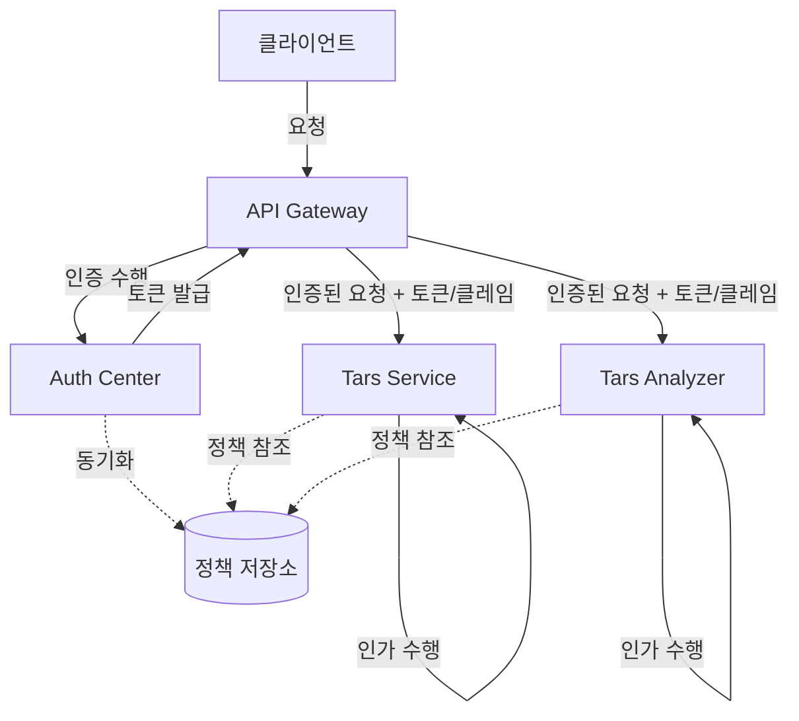

# tars

stock utilizer

## 변경 사항

auth repo 제거 예정

common 은 유지 및 고도화

### 인증과 인가: 책임의 분리

### git repo

[api-gateway](https://github.com/christopher3810/api-gateway)

[auth_center](https://github.com/christopher3810/auth_center)
