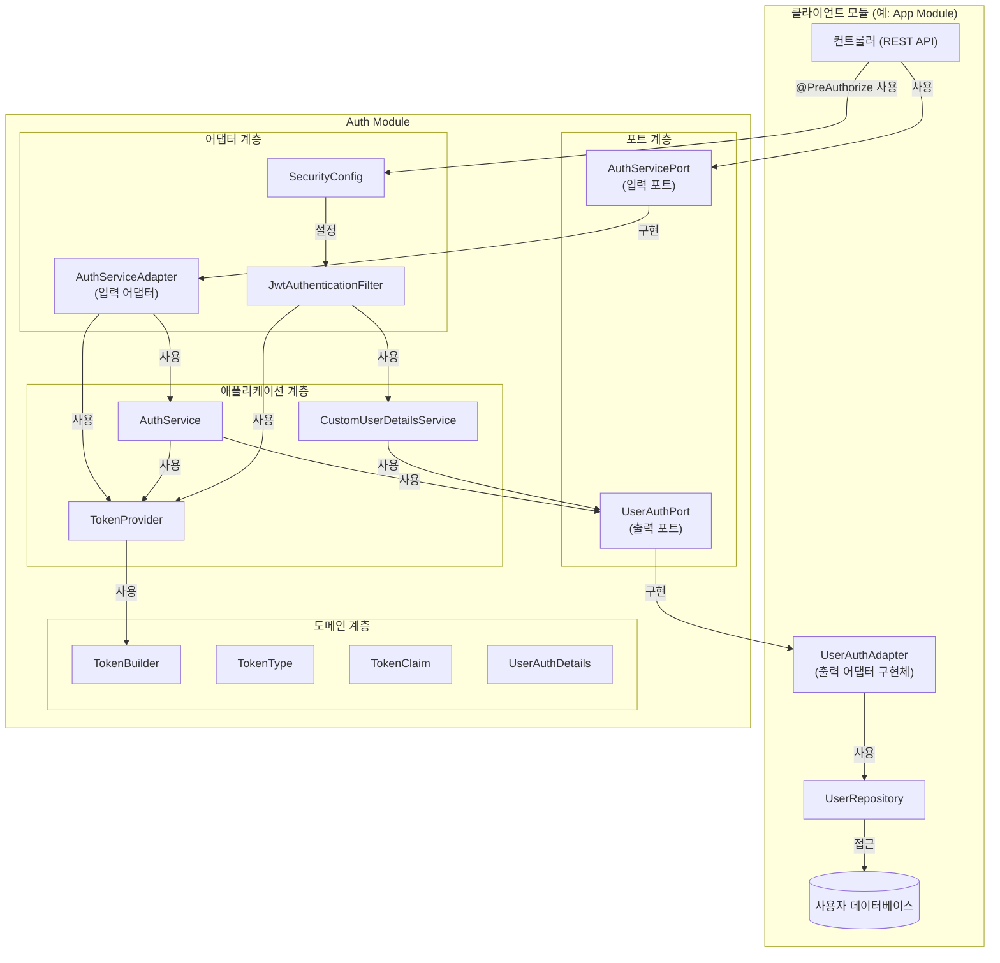
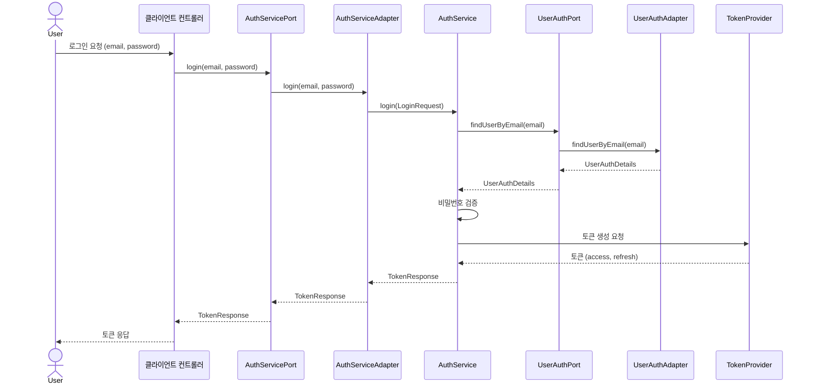
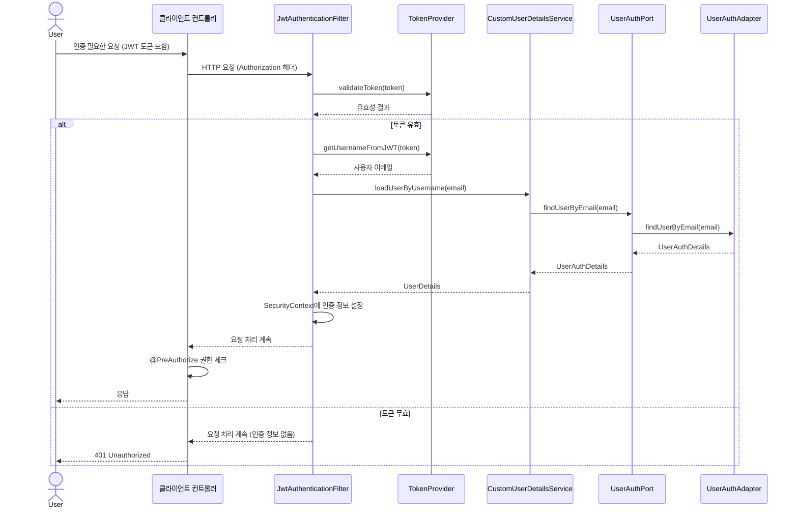
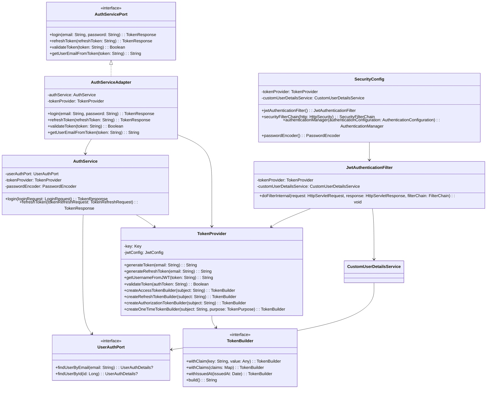

# Auth Module

TARS 프로젝트의 Auth Module은 인증 및 권한 관리 기능을 제공하는 라이브러리 모듈입니다. 이 모듈은 컨트롤러나 엔드포인트를 직접 제공하지 않으며, 다른 모듈에서 사용할 수 있는 인증/인가 관련 도구를 제공합니다.

## 아키텍처

이 모듈은 포트-어댑터 아키텍처(헥사고날 아키텍처)를 사용하여 구현되었습니다. 이 아키텍처는 애플리케이션의 핵심 로직을 외부 시스템과 분리하여 유연성과 테스트 용이성을 높이는 패턴입니다.

### 포트-어댑터 아키텍처 개념

- **포트(Port)**: 애플리케이션과 외부 시스템 간의 인터페이스를 정의합니다.
  - **입력 포트(Primary/Driving Port)**: 외부에서 애플리케이션을 사용하기 위한 인터페이스
  - **출력 포트(Secondary/Driven Port)**: 애플리케이션이 외부 시스템을 사용하기 위한 인터페이스

- **어댑터(Adapter)**: 포트의 구현체로, 실제 기술적 세부사항을 처리합니다.
  - **입력 어댑터(Primary/Driving Adapter)**: 입력 포트를 구현하여 외부 요청을 애플리케이션 코어로 전달
  - **출력 어댑터(Secondary/Driven Adapter)**: 출력 포트를 구현하여 애플리케이션 코어의 요청을 외부 시스템으로 전달

### 멀티모듈 환경에서의 Auth Module 구조



### 주요 컴포넌트 역할

#### Auth Module 내부

1. **입력 포트 (AuthServicePort)**
   - 클라이언트 모듈이 Auth Module의 기능을 사용하기 위한 인터페이스
   - 로그인, 토큰 갱신, 토큰 검증 등의 메서드 정의

2. **출력 포트 (UserAuthPort)**
   - Auth Module이 사용자 정보를 가져오기 위해 클라이언트 모듈에 요청하는 인터페이스
   - 이메일로 사용자 조회, ID로 사용자 조회 등의 메서드 정의

3. **입력 어댑터 (AuthServiceAdapter)**
   - AuthServicePort 인터페이스를 구현
   - 클라이언트 모듈의 요청을 애플리케이션 서비스로 전달

4. **애플리케이션 서비스 (AuthService, TokenProvider)**
   - 실제 인증/인가 로직 처리
   - 토큰 생성, 검증, 갱신 등의 기능 제공

5. **Spring Security 통합 (SecurityConfig, JwtAuthenticationFilter)**
   - Spring Security 설정 및 JWT 인증 필터 제공
   - 어노테이션 기반 권한 체크 지원

#### 클라이언트 모듈

1. **컨트롤러**
   - REST API 엔드포인트 제공
   - AuthServicePort를 통해 Auth Module의 기능 사용
   - @PreAuthorize 어노테이션을 통한 권한 체크

2. **출력 어댑터 구현체 (UserAuthAdapter)**
   - UserAuthPort 인터페이스를 구현
   - 실제 사용자 정보를 데이터베이스 등에서 조회하여 Auth Module에 제공

### 인증 흐름 예시

#### 로그인 흐름



#### 인증된 요청 흐름



### 클래스 다이어그램



## 주요 기능

Auth Module은 다음과 같은 주요 기능을 제공합니다:

1. **JWT 토큰 관리**: 다양한 전략의 토큰 생성, 검증, 파싱 기능
2. **인증 서비스**: 사용자 인증 및 토큰 갱신 로직
3. **Spring Security 통합**: 어노테이션 기반 권한 체크 기능
4. **확장 가능한 설계**: 포트-어댑터 아키텍처를 통한 유연한 확장성

## 멀티모듈 환경에서의 장점

1. **관심사 분리**
   - Auth Module은 인증/인가 로직만 담당
   - 클라이언트 모듈은 비즈니스 로직과 사용자 관리에 집중

2. **재사용성**
   - 여러 클라이언트 모듈에서 동일한 Auth Module을 사용 가능
   - 인증/인가 로직 변경 시 한 곳만 수정하면 됨

3. **유연성**
   - 포트-어댑터 아키텍처로 인해 구현 세부사항 변경이 용이
   - 예: 토큰 생성 방식 변경, 사용자 정보 조회 방식 변경 등

4. **테스트 용이성**
   - 인터페이스를 통한 의존성 주입으로 단위 테스트 용이
   - 모의 객체(Mock)를 사용한 테스트 가능

5. **데이터베이스 독립성**
   - Auth Module은 데이터베이스에 직접 접근하지 않음
   - 클라이언트 모듈이 자신의 데이터베이스 스키마와 접근 방식을 자유롭게 설계 가능

## 모듈 통합 방법

### 1. 의존성 추가

외부 모듈의 `build.gradle` 파일에 Auth Module 의존성을 추가합니다:

```gradle
dependencies {
    implementation('com.tars:auth-module:0.0.1-SNAPSHOT')
    // 기타 의존성...
}
```

### 2. 컴포넌트 스캔 설정

외부 모듈의 설정 클래스에서 Auth Module의 설정 클래스를 임포트합니다:

```kotlin
@Configuration
@Import(AuthModuleConfig::class)
class YourAppConfig {
    // 설정 내용...
}
```

또는 `@ComponentScan` 어노테이션을 사용하여 Auth Module의 패키지를 스캔 범위에 포함시킵니다:

```kotlin
@Configuration
@ComponentScan(basePackages = ["com.tars.app", "com.tars.auth"])
class YourAppConfig {
    // 설정 내용...
}
```

### 3. UserAuthPort 구현

Auth Module은 사용자 정보를 가져오기 위해 `UserAuthPort` 인터페이스를 제공합니다. 클라이언트 모듈에서 이 인터페이스를 구현하여 자체 데이터베이스에서 사용자 정보를 조회합니다:

```kotlin
@Component
class UserAuthAdapter(
    private val userRepository: UserRepository
) : UserAuthPort {
    override fun findUserByEmail(email: String): UserAuthDetails? {
        val user = userRepository.findByEmail(email) ?: return null
        
        // ID가 없는 경우 예외 처리 또는 기본값 사용
        val userId = user.id ?: throw IllegalStateException("User ID cannot be null")
        
        return UserAuthDetails(
            id = userId,
            email = user.email,
            hashedPassword = user.password,
            roles = user.roles.map { it.name }.toSet()
        )
    }
    
    override fun findUserById(id: Long): UserAuthDetails? {
        val user = userRepository.findById(id).orElse(null) ?: return null
        
        return UserAuthDetails(
            id = user.id,
            email = user.email,
            hashedPassword = user.password,
            roles = user.roles.map { it.name }.toSet()
        )
    }
}
```

이 구현에서는 사용자 ID가 null인 경우 예외를 발생시키거나, 기본값을 사용하여 항상 유효한 ID 값을 제공해야 합니다.

## 인증 및 권한 관리 사용 방법

### 1. 인증 서비스 사용

외부 모듈에서는 `AuthServicePort` 인터페이스를 통해 인증 기능을 사용할 수 있습니다:

```kotlin
@RestController
@RequestMapping("/api/auth")
class AuthController(
    private val authServicePort: AuthServicePort
) {
    @PostMapping("/login")
    fun login(@RequestBody request: LoginDto): ResponseEntity<TokenResponse> {
        try {
            val tokenResponse = authServicePort.login(request.email, request.password)
            return ResponseEntity.ok(tokenResponse)
        } catch (e: AuthenticationException) {
            return ResponseEntity.status(HttpStatus.UNAUTHORIZED).build()
        }
    }
    
    @PostMapping("/refresh")
    fun refreshToken(@RequestBody request: RefreshTokenDto): ResponseEntity<TokenResponse> {
        try {
            val tokenResponse = authServicePort.refreshToken(request.refreshToken)
            return ResponseEntity.ok(tokenResponse)
        } catch (e: AuthenticationException) {
            return ResponseEntity.status(HttpStatus.UNAUTHORIZED).build()
        }
    }
}
```

### 2. 권한 어노테이션 사용

컨트롤러 메서드에 Spring Security의 `@PreAuthorize` 어노테이션을 사용하여 권한을 체크할 수 있습니다:

```kotlin
@RestController
@RequestMapping("/api/resources")
class ResourceController {
    @GetMapping
    @PreAuthorize("hasRole('USER')")
    fun getResources(): List<Resource> {
        // 구현 내용...
    }
    
    @PostMapping
    @PreAuthorize("hasRole('ADMIN')")
    fun createResource(@RequestBody resource: Resource): Resource {
        // 구현 내용...
    }
}
```

### 3. 토큰 검증 및 사용

컨트롤러에서 토큰을 검증하고 사용자 정보를 추출하는 예시:

```kotlin
@RestController
@RequestMapping("/api/user")
class UserController(
    private val authServicePort: AuthServicePort,
    private val userService: UserService
) {
    @GetMapping("/me")
    fun getCurrentUser(@RequestHeader("Authorization") authHeader: String): UserResponse {
        val token = authHeader.substring(7) // "Bearer " 제거
        if (!authServicePort.validateToken(token)) {
            throw UnauthorizedException("Invalid token")
        }
        
        val email = authServicePort.getUserEmailFromToken(token)
        return userService.getUserByEmail(email)
    }
}
```

## 설정 예시

### application.yml 설정

```yaml
jwt:
  secret: your-secret-key-here-should-be-at-least-32-characters
  expiration-ms: 3600000  # 1시간
  refresh-expiration-ms: 86400000  # 24시간
```

## 주의사항

1. Auth Module을 사용하는 외부 모듈은 Spring Security 의존성을 자동으로 포함합니다.
2. JWT 토큰 설정(비밀 키, 만료 시간 등)은 애플리케이션 속성 파일에서 구성할 수 있습니다.
3. 사용자 정의 인증 로직이 필요한 경우 `UserAuthPort` 인터페이스를 구현하여 제공해야 합니다.
4. 컨트롤러는 외부 모듈에서 직접 구현해야 합니다. Auth Module은 컨트롤러를 제공하지 않습니다. 