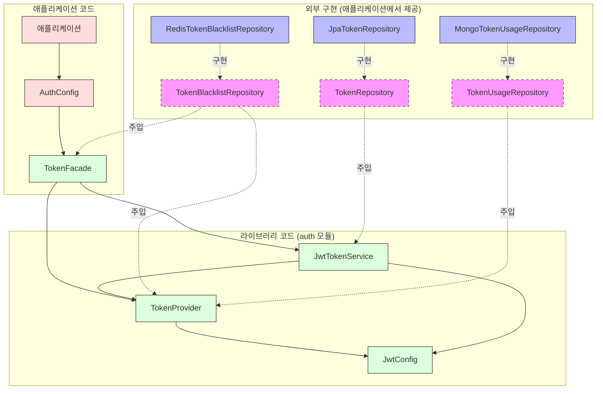
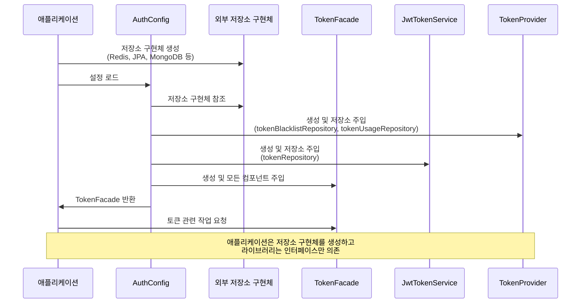
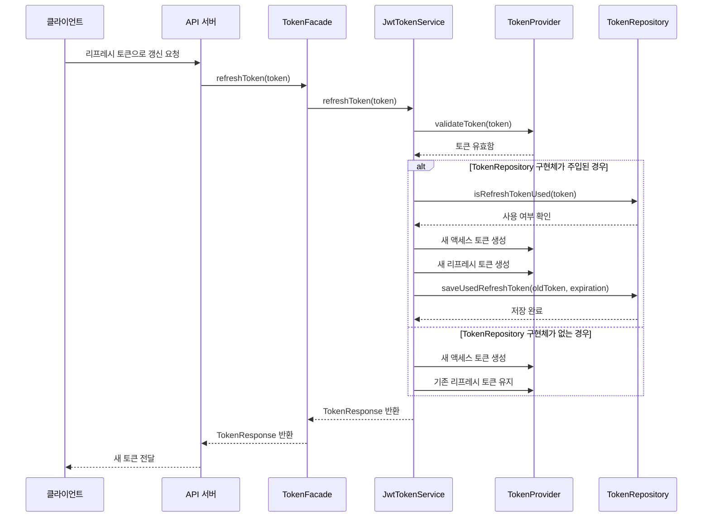

# JWT 토큰 보안 개선 방안 (라이브러리 버전)

현재 구현된 JWT 토큰 인증 시스템에 대한 보안 개선 방안을 정리합니다. `auth` 모듈은 라이브러리로 사용되므로 DB 의존성을 직접 가지지 않고, 인터페이스만 정의하여 라이브러리 사용자가 구현할 수 있도록 합니다.

## 1. 리프레시 토큰 순환(Rotation) 구현

### 현재 상태
- 현재는 리프레시 토큰을 사용해도 동일한 리프레시 토큰이 유지됨
- `JwtTokenService.refreshToken()` 메서드에서 기존 리프레시 토큰을 그대로 반환

### 개선 방안
- 리프레시 토큰 사용 시 새로운 리프레시 토큰 발급
- 이전 리프레시 토큰은 즉시 무효화 (선택적 기능)

### 구현 계획
1. 토큰 저장소 인터페이스 정의:
```kotlin
interface TokenRepository {
    fun saveUsedRefreshToken(token: String, expirationTime: Long)
    fun isRefreshTokenUsed(token: String): Boolean
}
```

2. `JwtTokenService` 클래스 수정 (선택적 의존성 주입):
```kotlin
class JwtTokenService(
    private val tokenProvider: TokenProvider,
    private val jwtConfig: JwtConfig = JwtConfig.standard(),
    private val tokenRepository: TokenRepository? = null // 선택적 의존성
) {
    fun refreshToken(refreshToken: String): TokenResponse {
        // 리프레시 토큰 검증
        if (!tokenProvider.validateToken(refreshToken)) {
            throw TokenException("Invalid refresh token")
        }
        
        // 토큰 저장소가 있으면 사용된 토큰인지 확인
        tokenRepository?.let {
            if (it.isRefreshTokenUsed(refreshToken)) {
                throw TokenException("Refresh token has been used")
            }
        }
        
        // ... 토큰 생성 로직 ...
        
        // 토큰 저장소가 있으면 이전 토큰 무효화
        tokenRepository?.let {
            val claims = tokenProvider.getClaimsFromToken(refreshToken)
            val expiration = claims.expiration.time
            it.saveUsedRefreshToken(refreshToken, expiration)
        }
        
        return TokenResponse(
            accessToken = accessToken,
            refreshToken = newRefreshToken,
            expiresIn = jwtConfig.expirationMs / 1000
        )
    }
}
```

## 2. 토큰 블랙리스트 구현

### 현재 상태
- 토큰 무효화 메커니즘이 없음
- 만료되기 전까지 모든 토큰이 유효함

### 개선 방안
- 로그아웃 시 토큰을 블랙리스트에 추가 (선택적 기능)
- 블랙리스트에 있는 토큰은 검증 시 무효화

### 구현 계획
1. 토큰 블랙리스트 저장소 인터페이스 정의:
```kotlin
interface TokenBlacklistRepository {
    fun addToBlacklist(token: String, expirationTime: Long)
    fun isBlacklisted(token: String): Boolean
}
```

2. `TokenProvider` 클래스 수정 (선택적 의존성 주입):
```kotlin
class TokenProvider(
    private val jwtConfig: JwtConfig,
    private val tokenBlacklistRepository: TokenBlacklistRepository? = null // 선택적 의존성
) {
    fun validateToken(authToken: String): Boolean {
        // 블랙리스트 확인 (저장소가 있는 경우)
        if (tokenBlacklistRepository?.isBlacklisted(authToken) == true) {
            return false
        }
        
        // ... 기존 검증 로직 ...
    }
}
```

3. `TokenFacade`에 로그아웃 메서드 추가:
```kotlin
fun logout(accessToken: String, refreshToken: String) {
    // 블랙리스트 저장소가 있는 경우에만 처리
    tokenBlacklistRepository?.let { repository ->
        try {
            // 액세스 토큰 블랙리스트에 추가
            val accessTokenClaims = tokenProvider.getClaimsFromToken(accessToken)
            val accessTokenExp = accessTokenClaims.expiration.time
            repository.addToBlacklist(accessToken, accessTokenExp)
            
            // 리프레시 토큰 블랙리스트에 추가
            val refreshTokenClaims = tokenProvider.getClaimsFromToken(refreshToken)
            val refreshTokenExp = refreshTokenClaims.expiration.time
            repository.addToBlacklist(refreshToken, refreshTokenExp)
        } catch (ex: Exception) {
            // 토큰 파싱 실패 시 예외 처리
        }
    }
}
```

## 3. 토큰 메타데이터 추가

### 현재 상태
- 토큰에 기본 정보만 포함 (사용자 ID, 이메일, 역할)
- 토큰 발급 환경에 대한 정보 없음

### 개선 방안
- 토큰에 기기 ID, IP 주소 등 메타데이터 추가
- 토큰 검증 시 메타데이터 확인 (선택적 기능)

### 구현 계획
1. `TokenClaim` enum 확장:
```kotlin
enum class TokenClaim(val value: String) {
    USER_ID("userId"),
    ROLES("roles"),
    PERMISSIONS("permissions"),
    TYPE("type"),
    PURPOSE("purpose"),
    DEVICE_ID("deviceId"),
    IP_ADDRESS("ipAddress"),
    USER_AGENT("userAgent")
}
```

2. `TokenMetadata` 데이터 클래스 추가:
```kotlin
data class TokenMetadata(
    val deviceId: String,
    val ipAddress: String,
    val userAgent: String
)
```

3. `JwtTokenService`의 토큰 생성 메서드 확장:
```kotlin
fun generateTokens(userInfo: UserTokenInfo, tokenMetadata: TokenMetadata? = null): TokenResponse {
    // 액세스 토큰 생성
    val authorizationTokenBuilder = tokenProvider.createAuthorizationTokenBuilder(userInfo.email)
        .withClaim(TokenClaim.USER_ID.value, userInfo.id)
    
    // 메타데이터 추가 (있는 경우)
    tokenMetadata?.let { metadata ->
        authorizationTokenBuilder
            .withClaim(TokenClaim.DEVICE_ID.value, metadata.deviceId)
            .withClaim(TokenClaim.IP_ADDRESS.value, metadata.ipAddress)
            .withClaim(TokenClaim.USER_AGENT.value, metadata.userAgent)
    }
    
    // ... 나머지 코드 ...
}
```

## 4. 토큰 사용 추적 및 이상 감지

### 현재 상태
- 토큰 사용에 대한 추적 없음
- 비정상적인 사용 패턴 감지 불가

### 개선 방안
- 토큰 사용 이력 저장 (선택적 기능)
- 비정상적인 패턴 감지 시 토큰 무효화 (선택적 기능)

### 구현 계획
1. 토큰 사용 이력 저장소 인터페이스 정의:
```kotlin
interface TokenUsageRepository {
    fun recordTokenUsage(token: String, metadata: TokenUsageMetadata)
    fun getTokenUsageHistory(userId: Long): List<TokenUsageMetadata>
    fun detectAnomalousUsage(token: String, metadata: TokenUsageMetadata): Boolean
}
```

2. `TokenUsageMetadata` 데이터 클래스 추가:
```kotlin
data class TokenUsageMetadata(
    val userId: Long,
    val tokenId: String,
    val ipAddress: String,
    val deviceId: String,
    val userAgent: String,
    val timestamp: Long = System.currentTimeMillis()
)
```

3. `TokenProvider`의 `validateToken` 메서드 확장:
```kotlin
fun validateToken(authToken: String, metadata: TokenUsageMetadata? = null): Boolean {
    // 기본 검증
    if (!validateBasicToken(authToken)) {
        return false
    }
    
    // 사용 추적 및 이상 감지 (저장소가 있는 경우)
    if (metadata != null && tokenUsageRepository != null) {
        // 이상 사용 감지
        if (tokenUsageRepository.detectAnomalousUsage(authToken, metadata)) {
            // 블랙리스트 저장소가 있으면 토큰 무효화
            tokenBlacklistRepository?.let {
                val claims = getClaimsFromToken(authToken)
                val expiration = claims.expiration.time
                it.addToBlacklist(authToken, expiration)
            }
            return false
        }
        
        // 사용 이력 기록
        tokenUsageRepository.recordTokenUsage(authToken, metadata)
    }
    
    return true
}

// 기본 토큰 검증 로직 분리
private fun validateBasicToken(authToken: String): Boolean {
    // 블랙리스트 확인 (저장소가 있는 경우)
    if (tokenBlacklistRepository?.isBlacklisted(authToken) == true) {
        return false
    }
    
    return try {
        Jwts.parserBuilder()
            .setSigningKey(key)
            .build()
            .parseClaimsJws(authToken)
        true
    } catch (ex: Exception) {
        false
    }
}
```

## 5. 리프레시 토큰 수명 조정

### 현재 상태
- 리프레시 토큰 수명: 24시간 (86400000ms)
- 액세스 토큰 수명: 1시간 (3600000ms)

### 개선 방안
- 리프레시 토큰 수명을 사용 패턴에 따라 조정 (선택적 기능)
- 중요 작업 시 리프레시 토큰 수명 단축

### 구현 계획
1. `RiskLevel` enum 추가:
```kotlin
enum class RiskLevel {
    LOW, // 일반적인 사용
    MEDIUM, // 약간 의심스러운 패턴
    HIGH // 매우 의심스러운 패턴
}
```

2. `JwtConfig` 인터페이스에 메서드 추가:
```kotlin
interface JwtConfig {
    // ... 기존 속성 ...
    
    // 사용 패턴에 따른 리프레시 토큰 수명 계산 (기본 구현 제공)
    fun calculateRefreshTokenExpiration(userInfo: UserTokenInfo, riskLevel: RiskLevel): Long {
        return when (riskLevel) {
            RiskLevel.LOW -> refreshExpirationMs
            RiskLevel.MEDIUM -> refreshExpirationMs / 2
            RiskLevel.HIGH -> refreshExpirationMs / 8
        }
    }
}
```

3. `JwtTokenService`의 토큰 생성 메서드 확장:
```kotlin
fun generateTokens(
    userInfo: UserTokenInfo, 
    tokenMetadata: TokenMetadata? = null,
    riskLevel: RiskLevel = RiskLevel.LOW
): TokenResponse {
    // ... 액세스 토큰 생성 로직 ...
    
    // 리프레시 토큰 생성 (위험 수준에 따른 만료 시간 조정)
    val refreshExpirationMs = jwtConfig.calculateRefreshTokenExpiration(userInfo, riskLevel)
    val refreshToken = tokenProvider.createRefreshTokenBuilder(userInfo.email)
        .withClaim(TokenClaim.USER_ID.value, userInfo.id)
        .withExpirationMs(refreshExpirationMs) // 커스텀 만료 시간 설정
        .build()
    
    // ... 나머지 코드 ...
}
```

## 6. 중요 작업 추가 인증 구현

### 현재 상태
- 모든 API 요청에 동일한 인증 방식 적용
- 중요 작업에 대한 추가 보안 없음

### 개선 방안
- 중요 작업(비밀번호 변경, 결제 등)에 추가 인증 요구
- 짧은 수명의 특수 토큰 발급

### 구현 계획
1. `TokenPurpose` enum 확장:
```kotlin
enum class TokenPurpose(val value: String) {
    EMAIL_VERIFICATION("email_verification"),
    PASSWORD_RESET("password_reset"),
    PAYMENT_AUTHORIZATION("payment_authorization"),
    SENSITIVE_ACTION("sensitive_action")
}
```

2. 중요 작업용 토큰 생성 메서드 추가:
```kotlin
fun generateSensitiveActionToken(userInfo: UserTokenInfo, purpose: TokenPurpose): String {
    // 짧은 수명의 토큰 생성 (예: 5분)
    val shortExpirationMs = 300000L
    
    return tokenProvider.createOneTimeTokenBuilder(userInfo.email, purpose)
        .withClaim(TokenClaim.USER_ID.value, userInfo.id)
        // 커스텀 만료 시간 설정
        .withExpirationMs(shortExpirationMs)
        .build()
}
```

## 라이브러리 사용자를 위한 가이드

라이브러리 사용자가 인터페이스를 구현하는 방법에 대한 예시:

### Redis를 사용한 TokenBlacklistRepository 구현 예시
```kotlin
@Component
class RedisTokenBlacklistRepository(
    private val redisTemplate: RedisTemplate<String, String>
) : TokenBlacklistRepository {
    
    private val keyPrefix = "token:blacklist:"
    
    override fun addToBlacklist(token: String, expirationTime: Long) {
        val key = keyPrefix + token
        val ttl = expirationTime - System.currentTimeMillis()
        
        if (ttl > 0) {
            redisTemplate.opsForValue().set(key, "1")
            redisTemplate.expire(key, ttl, TimeUnit.MILLISECONDS)
        }
    }
    
    override fun isBlacklisted(token: String): Boolean {
        return redisTemplate.hasKey(keyPrefix + token)
    }
}
```

### JPA를 사용한 TokenRepository 구현 예시
```kotlin
@Component
class JpaTokenRepository(
    private val usedTokenJpaRepository: UsedTokenJpaRepository
) : TokenRepository {
    
    override fun saveUsedRefreshToken(token: String, expirationTime: Long) {
        val usedToken = UsedToken(
            token = token,
            expirationTime = Instant.ofEpochMilli(expirationTime)
        )
        usedTokenJpaRepository.save(usedToken)
    }
    
    override fun isRefreshTokenUsed(token: String): Boolean {
        return usedTokenJpaRepository.existsByToken(token)
    }
}

@Entity
@Table(name = "used_tokens")
class UsedToken(
    @Id
    @Column(length = 500)
    val token: String,
    
    val expirationTime: Instant
)

interface UsedTokenJpaRepository : JpaRepository<UsedToken, String> {
    fun existsByToken(token: String): Boolean
}
```

### 라이브러리 사용자의 설정 예시
```kotlin
@Configuration
class AuthConfig {
    
    @Bean
    fun tokenFacade(
        @Autowired(required = false) tokenBlacklistRepository: TokenBlacklistRepository?,
        @Autowired(required = false) tokenRepository: TokenRepository?,
        @Autowired(required = false) tokenUsageRepository: TokenUsageRepository?
    ): TokenFacade {
        val jwtConfig = JwtConfig.builder()
            .secret(secretKey)
            .expirationMs(3600000L)
            .refreshExpirationMs(86400000L)
            .build()
            
        val tokenProvider = TokenProvider(
            jwtConfig = jwtConfig,
            tokenBlacklistRepository = tokenBlacklistRepository,
            tokenUsageRepository = tokenUsageRepository
        )
        
        val tokenService = JwtTokenService(
            tokenProvider = tokenProvider,
            jwtConfig = jwtConfig,
            tokenRepository = tokenRepository
        )
        
        return TokenFacade(
            jwtConfig = jwtConfig,
            tokenProvider = tokenProvider,
            tokenService = tokenService,
            tokenBlacklistRepository = tokenBlacklistRepository
        )
    }
}
```

## 구현 우선순위

1. **리프레시 토큰 순환(Rotation)** - 가장 기본적인 보안 개선
2. **토큰 블랙리스트** - 로그아웃 및 토큰 무효화 지원
3. **토큰 메타데이터 추가** - 보안 컨텍스트 강화
4. **토큰 사용 추적** - 이상 감지 기반 마련
5. **리프레시 토큰 수명 조정** - 상황별 보안 강화
6. **중요 작업 추가 인증** - 고급 보안 기능

## 기술적 고려사항

1. **선택적 의존성**: 모든 저장소 의존성은 선택적(optional)으로 구현하여 라이브러리 사용자가 필요에 따라 구현할 수 있도록 함
2. **성능 최적화**: 토큰 검증은 매우 빈번하므로 캐싱 전략 필요
3. **확장성**: 마이크로서비스 환경에서 토큰 블랙리스트 공유 방안 고려
4. **보안 로깅**: 토큰 관련 이벤트 로깅 및 모니터링 체계 구축
5. **점진적 도입**: 모든 기능을 한번에 구현하기보다 단계적으로 도입

## 구현 아키텍처 다이어그램

아래 다이어그램은 JWT 토큰 보안 시스템의 구현 아키텍처와 외부 저장소(Repository)가 어떻게 통합되는지 보여줍니다.



## 의존성 주입 흐름 다이어그램

아래 다이어그램은 외부 저장소가 어떻게 라이브러리에 주입되는지 보여줍니다.



## 토큰 갱신 프로세스 다이어그램

리프레시 토큰 순환(Rotation) 기능이 활성화된 경우의 토큰 갱신 프로세스입니다.

