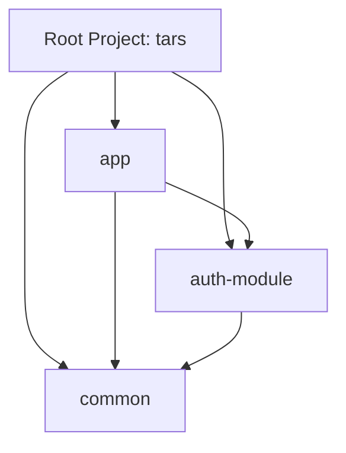
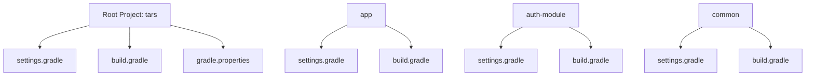
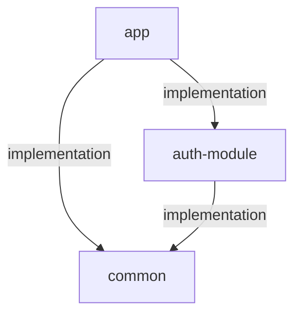
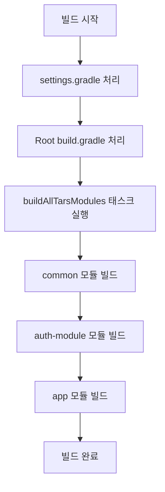

# TARS 프로젝트 멀티 모듈 구조

TARS 프로젝트는 헥사고날 아키텍처와 DDD 기반 멀티 모듈 Spring Boot App.

## 모듈 구조



## 모듈 설명

- **app**: 메인 애플리케이션 모듈로, 비즈니스 로직과 도메인 모델을 포함.
- **auth-module**: 인증 및 인가 관련 역할을 담당하는 모듈.
- **common**: 공통 유틸리티와 공유 코드를 포함하는 모듈.

## 주요 설정 파일 구조



## 주요 설정 내용

### Root 프로젝트 (build.gradle)

- **tars 그룹 태스크**: 모든 모듈을 한 번에 빌드하거나 클린하는 태스크 제공

#### 모듈별 settings.gradle

- **app**: auth-module과 common 모듈을 포함(includeBuild)
- **auth-module**: common 모듈을 포함(includeBuild)
- **common**: 독립적인 설정

#### 모듈별 build.gradle

- **app**: 애플리케이션 모듈로 실행 가능한 jar 생성
- **auth-module**: 라이브러리 모듈로 jar 생성 (bootJar 비활성화)
- **common**: 라이브러리 모듈로 jar 생성 (bootJar 비활성화)

## 모듈 간 의존성 관계



## 의존성 관리 방식

각 모듈은 Composite Build 방식으로 의존성을 관리

- **app 모듈**: `implementation('com.tars:auth-module:0.0.1-SNAPSHOT')`, `implementation('com.tars:common:0.0.1-SNAPSHOT')`
- **auth-module**: `implementation('com.tars:common:0.0.1-SNAPSHOT')`

## 빌드 프로세스



## 주요 Gradle 태스크

루트 프로젝트에서는 다음과 같은 태스크를 제공

- **buildAllTarsModules**: 모든 모듈을 순서대로 빌드 (common -> auth-module -> app).
- **cleanAllTarsModules**: 모든 모듈의 빌드 결과물을 정리

이 태스크들은 `tars` 그룹에 속해 있어 `./gradlew tasks --group=tars` 명령으로 확인할 수 있습니다.

## 독립적인 모듈 빌드

각 모듈은 독립적으로 빌드가능.

```bash
cd common && ./gradlew build
cd auth-module && ./gradlew build
cd app && ./gradlew build
```

## 전체 프로젝트 빌드

루트 프로젝트에서 전체 빌드를 실행가능.

```bash
./gradlew buildAllTarsModules
``` 