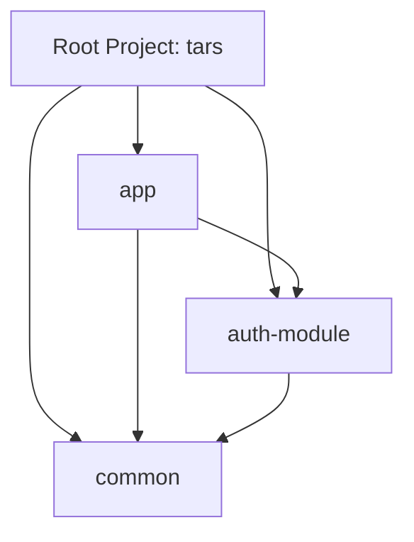
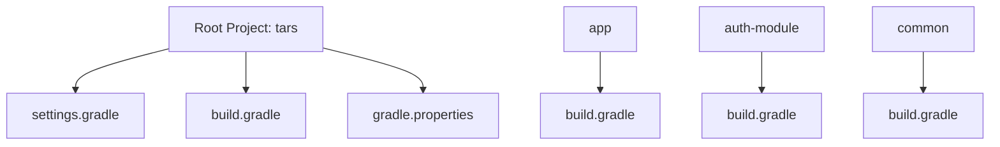
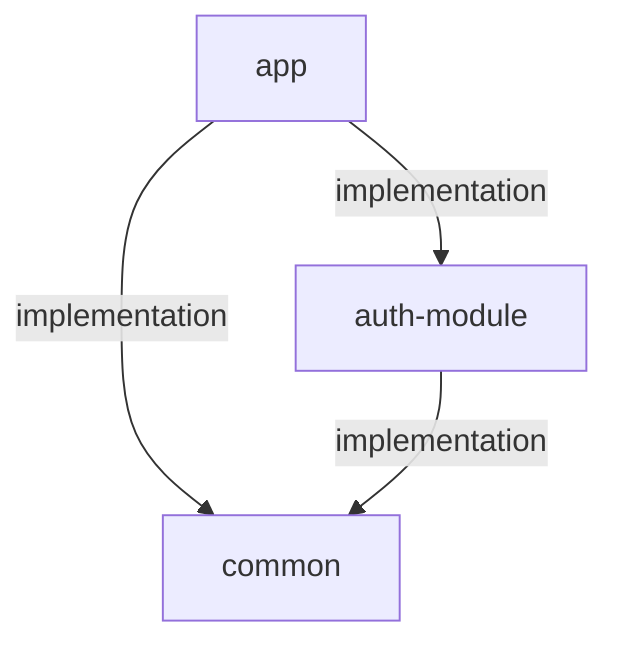
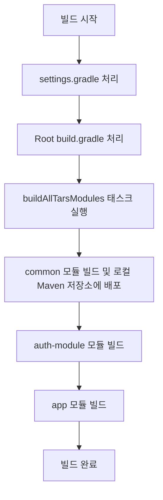

# TARS 프로젝트 멀티 모듈 구조

TARS 프로젝트는 헥사고날 아키텍처와 DDD 기반 멀티 모듈 Spring Boot App.

## 모듈 구조



## 모듈 설명

- **app**: 메인 애플리케이션 모듈로, 비즈니스 로직과 도메인 모델을 포함.
- **auth-module**: 인증 및 인가 관련 역할을 담당하는 모듈. 포트-어댑터 아키텍처 적용.
- **common**: 공통 유틸리티와 공유 코드를 포함하는 순수 Kotlin 라이브러리 모듈. Spring 의존성 없음.

## 주요 설정 파일 구조



## 주요 설정 내용

### Root 프로젝트 (build.gradle)

- **tars 그룹 태스크**: 모든 모듈을 한 번에 빌드하거나 클린하는 태스크 제공
- **buildCommon 태스크**: common 모듈을 빌드하고 로컬 Maven 저장소에 배포하는 태스크

#### 모듈별 build.gradle

- **app**: 애플리케이션 모듈로 실행 가능한 jar 생성
- **auth-module**: 라이브러리 모듈로 jar 생성 (bootJar 비활성화)
- **common**: 순수 라이브러리 모듈로 jar 생성 (Spring 의존성 없음)

## 모듈 간 의존성 관계



## 의존성 관리 방식

각 모듈은 Maven 로컬 저장소를 통해 의존성을 관리

- **app 모듈**: `implementation('com.tars:auth-module:0.0.1-SNAPSHOT')`, `implementation('com.tars:common:0.0.1-SNAPSHOT')`
- **auth-module**: `implementation('com.tars:common:0.0.1-SNAPSHOT')`

## 빌드 프로세스



## 주요 Gradle 태스크

루트 프로젝트에서는 다음과 같은 태스크를 제공

- **buildAllTarsModules**: 모든 모듈을 순서대로 빌드 (common -> auth-module -> app).
- **cleanAllTarsModules**: 모든 모듈의 빌드 결과물을 정리
- **buildCommon**: common 모듈만 빌드하고 로컬 Maven 저장소에 배포

이 태스크들은 `tars` 그룹에 속해 있어 `./gradlew tasks --group=tars` 명령으로 확인할 수 있습니다.

## 빌드 스크립트 특징

- 루트 프로젝트의 `gradlew`를 사용하여 각 모듈을 빌드합니다.
- 운영체제에 따라 적절한 gradlew 명령(Windows의 경우 gradlew.bat, 그 외의 경우 gradlew)을 사용합니다.
- 각 모듈 디렉토리에 별도의 gradlew 파일이 없어도 빌드가 가능합니다.

## 모듈별 특징

### common 모듈

- Spring 의존성 없는 순수 Kotlin 라이브러리
- 테스트는 Kotest 프레임워크를 사용하여 describe-context-it 패턴의 BDD 스타일로 작성
- Maven 로컬 저장소에 배포되어 다른 모듈에서 의존성으로 사용

### auth-module

- 포트-어댑터 아키텍처 적용
- 인증 및 인가 관련 기능 제공
- common 모듈을 의존성으로 사용

### app 모듈

- 메인 애플리케이션 모듈
- auth-module과 common 모듈을 의존성으로 사용

## 빌드 순서 및 의존성 관리

1. common 모듈 빌드 및 로컬 Maven 저장소에 배포
2. auth-module 빌드 (common 의존성 사용)
3. app 모듈 빌드 (auth-module, common 의존성 사용)

## 전체 프로젝트 빌드

루트 프로젝트에서 전체 빌드를 실행가능.

```bash
./gradlew buildAllTarsModules
```

## common 모듈만 빌드 및 배포

```bash
./gradlew buildCommon
``` 