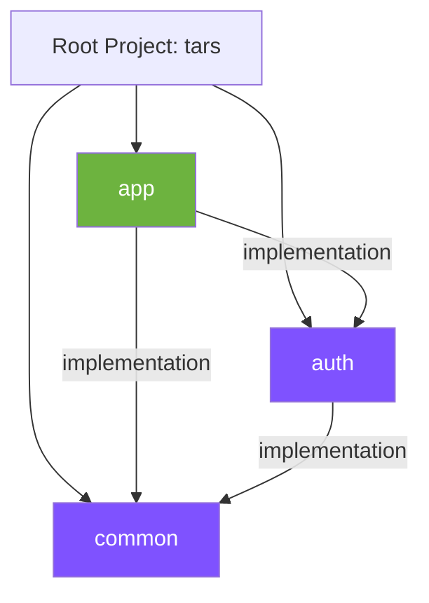
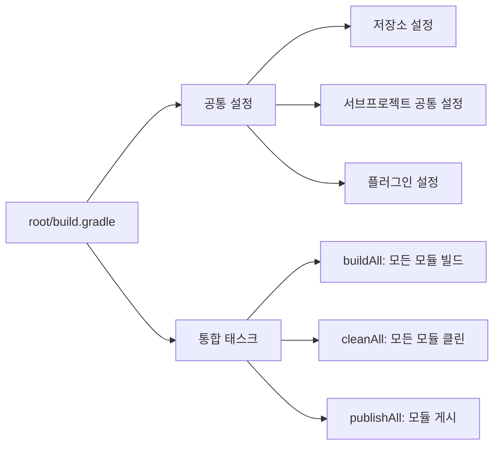
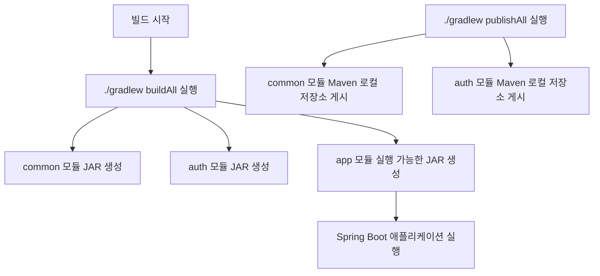

# TARS 프로젝트 멀티 모듈 구조

TARS 프로젝트는 헥사고날 아키텍처와 DDD 기반의 멀티 모듈 Spring Boot 애플리케이션입니다.

## 모듈 구조

## 모듈 설명

- **app**: 메인 애플리케이션 모듈 - Spring Boot 애플리케이션으로 실행 가능한 jar 생성
- **auth**: 인증 및 인가 관련 기능을 제공하는 순수 Kotlin 라이브러리 모듈 (Spring 의존성 없음)
- **common**: 공통 유틸리티와 공유 코드를 포함하는 순수 Kotlin 라이브러리 모듈 (Spring 의존성 없음)

## 빌드 스크립트 핵심 특징

### 루트 프로젝트 (build.gradle)

## 빌드 및 배포 프로세스

## 주요 Gradle 태스크

루트 프로젝트에서는 다음과 같은 통합 태스크를 제공합니다:

- **buildAll**: 모든 모듈을 순차적으로 빌드
- **cleanAll**: 모든 모듈의 빌드 결과물을 정리
- **publishAll**: common 및 auth 모듈을 빌드하고 로컬 Maven 저장소에 게시

이 태스크들은 `tars` 그룹에 속해 있어 `./gradlew tasks --group=tars` 명령으로 확인할 수 있습니다.